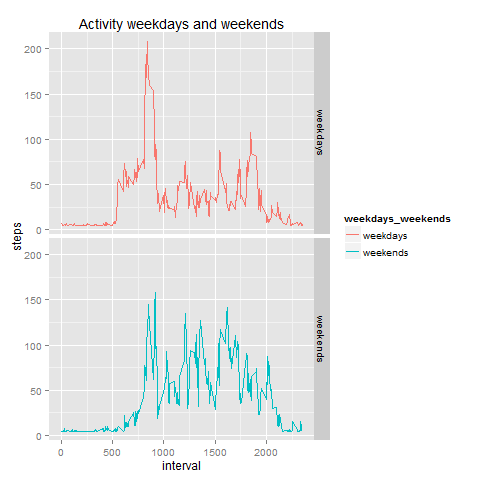

**ASSIGMENTE 1-REPRODUCIBLE RESEARCH**
====================================

*1. Loading and processing data.*
---------------------------------
1.1 Establish working directory

1.2 Load data.

```r
Base_Actividad=read.delim("activity.csv",header = T,sep = ",")
```
1.3 Change format of variable date.

```r
Base_Actividad$date=as.character(Base_Actividad$date)
Base_Actividad$date=as.Date(Base_Actividad$date,format = "%Y-%m-%d")
```
*2. What is mean total number of steps taken per day?*
----------------------------------------------------

For this part of the assignment, you can ignore the missing values in the dataset.

-Calculate the total number of steps taken per day.

```r
Pasos_por_dia=aggregate(steps~date,sum,data=Base_Actividad,na.rm=T)
head(Pasos_por_dia)
```

```
##         date steps
## 1 2012-10-02   126
## 2 2012-10-03 11352
## 3 2012-10-04 12116
## 4 2012-10-05 13294
## 5 2012-10-06 15420
## 6 2012-10-07 11015
```

-If you do not understand the difference between a histogram and a barplot, research the difference between them. Make a histogram of the total number of steps taken each day.

```r
library(ggplot2)
a=ggplot(Pasos_por_dia,aes(steps))
a=a+geom_histogram(binwidth=800,fill="turquoise",colour = "darkgreen")
a=a+ggtitle("Histogram of Steps Per Day")+ylab("Frequency")+xlab("Steps")
```


-Calculate and report the mean and median of the total number of steps taken per day.

```r
mean(Pasos_por_dia$steps,na.rm=T)
```

```
## [1] 10766.19
```

```r
median(Pasos_por_dia$steps,na.rm=T)
```

```
## [1] 10765
```

*3. What is the average daily activity pattern?*
-------------------------------------------

-Make a time series plot (i.e. type = "l") of the 5-minute interval (x-axis) and the average number of steps taken, averaged across all days (y-axis)
  
  1.Create a new database grouped by steps per interval used the function `aggregate()`.

```r
Pasos_interrvalo=aggregate(steps~interval,mean,data=Base_Actividad,na.rm=T)
```
  2.Create a time line of mean steps per interval.

```r
b=ggplot(Pasos_interrvalo,aes(interval,steps))
b=b+geom_line(color="orangered1")
b=b+ggtitle("Time Series-Mean Steps per Interval")
```


-Which 5-minute interval, on average across all the days in the dataset, contains the maximum number of steps?
  1.For this part I used the function `subset()`

```r
maximun_steps=subset(Pasos_interrvalo,Pasos_interrvalo$steps==max(Pasos_interrvalo$steps))
maximun_steps
```

```
##     interval    steps
## 104      835 206.1698
```

*4. Imputing missing values*
---------------------------

Note that there are a number of days/intervals where there are missing values (coded as NA). The presence of missing days may introduce bias into some calculations or summaries of the data.

  1.Calculate and report the total number of missing values in the dataset (i.e. the total number of rows with NAs)

```r
sum(is.na(Base_Actividad))
```

```
## [1] 2304
```

  2.Devise a strategy for filling in all of the missing values in the dataset. The strategy does not need to be sophisticated. For example, you could use the mean/median for that day, or the mean for that 5-minute interval, etc.

  **-For this part I used the mean of steps per interval**
  
  3. Working in other database 
  

```r
Base_complete=Base_Actividad
```

  -Fill NAs with the mean of steps per interval
  

```r
Base_complete$steps[is.na(Base_complete$steps)]=mean(Pasos_interrvalo$steps)
```

  4. Make a histogram of the total number of steps taken each day and Calculate and report the mean and median total number of steps taken per day. Do these values differ from the estimates from the first part of the assignment? What is the impact of imputing missing data on the estimates of the total daily number of steps?


```r
  CompletSteps=aggregate(steps~date,sum,data=Base_complete)
  head(CompletSteps)
```

```
##         date    steps
## 1 2012-10-01 10766.19
## 2 2012-10-02   126.00
## 3 2012-10-03 11352.00
## 4 2012-10-04 12116.00
## 5 2012-10-05 13294.00
## 6 2012-10-06 15420.00
```

```r
 library(ggplot2)
  c=ggplot(CompletSteps,aes(steps))
  c=c+geom_histogram(binwidth=800,fill="green1",colour = "darkgreen")
  c=c+ggtitle("Histogram of Steps Per Day-without NAs")+ylab("Frequency")+xlab("Steps")
```


```r
 mean(CompletSteps$steps)
```

```
## [1] 10766.19
```

```r
 median(CompletSteps$steps)
```

```
## [1] 10766.19
```

  **-We can see that there is not a big differences between data with missing values and data without missing values**

*5. Are there differences in activity patterns between weekdays and weekends?*
-----------------------------------------------------------------------------

  1.Create a new factor variable in the dataset with two levels - "weekday" and "weekend" indicating whether a given date is a weekday or weekend day.

  -I used the function `weekdays()`


```r
Base_complete$weekdays_weekends=weekdays(Base_complete$date)
```

  -With the function `ifelse()` I can specify if a day is a weekend.
  

```r
Base_complete$weekdays_weekends=ifelse(Base_complete$weekdays_weekends=="sábado"|
                                         Base_complete$weekdays_weekends=="domingo","weekends","weekdays")
```

  -Show de database


```r
StepsInterrvalo=aggregate(steps~interval+weekdays_weekends,mean,data=Base_complete)
head(StepsInterrvalo)
```

```
##   interval weekdays_weekends    steps
## 1        0          weekdays 7.006569
## 2        5          weekdays 5.384347
## 3       10          weekdays 5.139902
## 4       15          weekdays 5.162124
## 5       20          weekdays 5.073235
## 6       25          weekdays 6.295458
```

  2. Make a panel plot containing a time series plot (i.e. type = "l") of the 5-minute interval (x-axis) and the average number of steps taken, averaged across all weekday days or weekend days (y-axis). See the README file in the GitHub repository to see an example of what this plot should look like using simulated data.


```r
d=ggplot(StepsInterrvalo,aes(interval,steps,color=weekdays_weekends))
  d=d+geom_line()
  d=d+facet_grid(weekdays_weekends~.)
  d=d+ggtitle("Activity weekdays and weekends")
```



  **-It can be seen that there weekends greater activity than other days.**
